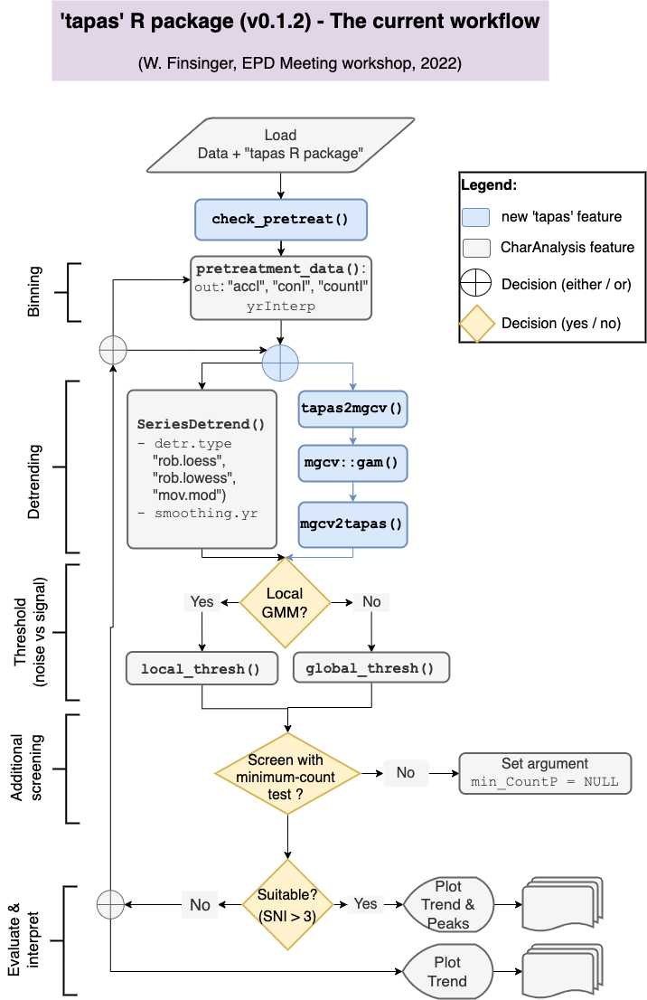

# tapas R package workshop (EPD Meeting, Prague, 2022)

### Author: 
*  Walter Finsinger

## The `tapas` R package
The `tapas` v0.1.2 R package (Finsinger & Bonnici, 2022) builds on CharAnalysis (https://github.com/phiguera/CharAnalysis),
a software for analyzing sediment-charcoal records written in and compiled
with Matlab 7.0 by Phil Higuera (Higuera et al., 2009), with significant input
by (amongst others) Patrick Bartlein (U of OR), Daniel Gavin (U of OR),
Jennifer Marlon, and Ryan Kelly.
The core of most functions that are included in the `tapas` package was
translated verbatim from CharAnalysis.

## The tutorial
The tutorial is meant to illustrate a simple workflow to perform
trend and peak-detection analysis of macroscopic charcoal records. The tutorial R script (`tapas_workshop_EPD_2022.R`) is a slightly simplified version in comparison to the R script that was distributed to the participants of the "CharAnalysis in R" workshop during the EPD Meeting (03-04 June 2022, Prague, Czech Republic).

In this tutorial, we'll be using the macroscopic charcoal record from
Code Lake (Higuera et al., 2009). Please be aware that the tutorial shows
how the tapas package performs the peak-detection analysis with this data set
using different options than those chosen by Higuera et al. (2009).

Specifically, the tutorial uses the so-called 'global' threshold rather than
the so-called 'local threshold'. However, the tapas package also allows
performing the anlysis with the so-called 'local' threshold, as does
CharAnalysis.

## How to use this repository
1. Download the *.zip folder by clicking on the green button in the upper right corner (Code), or
    download the `tapas_workshop_EPD_2022.R` file;
2. Open the `tapas_workshop_EPD_2022.R` file;
3. Run the script in R or RStudio.

A brief sketch of the typical CharAnalysis workflow (and additions to that in the `tapas` package) is illustrated in the figure here below: 

 

## Contributions
This project is an open project, and contributions are welcome from any individual and issues and bug reports are always welcome. Code clean-up, and feature additions can be done either through pull requests to project forks or project branches, or by adding a new issue.

## Cited references
Finsinger W., Bonnici I. (2022) - Tapas: an R package to perform trend and peaks analysis. Zenodo, https://doi.org/10.5281/zenodo.6344463.

Higuera PE, LB Brubaker, PM Anderson, FS Hu, TA Brown (2009) Vegetation mediated the impacts of postglacial climatic change on fire regimes in the south-central Brooks Range. Alaska Ecological Monographs 79: 201-219.
